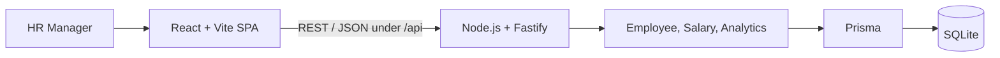

# ACME Salary Management

ACME Salary Management is a web application for an HR manager to browse employee compensation, preserve effective-dated salary history, record salary changes, and understand pay across a synthetic 10,000-person global organization. It is an assessment-scale system, not a payroll product or a safe store for real employee data.

## Live demo

A public deployment and demo video are not currently available. The repository contains a reviewed Render Blueprint in [`render.yaml`](./render.yaml), but provisioning still requires the current branch to be pushed and a paid persistent disk to be created. No placeholder URL is presented as a working deployment.

## Product overview

The application gives one assumed HR persona two focused workspaces:

- **Compensation Insights** shows headcount and currency-separated salary statistics by department and country.
- **Employee Directory** provides server-side search, filtering, sorting, pagination, employee details, salary history, and an append-only salary-change workflow.

The deterministic seed creates exactly 10,000 fictional employees across eight countries and eight departments, with 14,064 illustrative salary records. The data is reproducible and is not a claim about real-market compensation.

## Key features

- Server-side employee search, country/department filtering, stable sorting, and bounded pagination.
- Employee profiles with current salary and ordered salary history.
- Effective-dated changes that preserve history and support future scheduled salaries.
- Current salary derived from the latest record effective at or before request time.
- Integer minor-unit money representation; floating-point salary storage is rejected.
- Currency-aware summary, department, and country analytics with no implicit FX conversion.
- Predictable validation and API error contracts.
- Deterministic unit, integration, React behavior, and Playwright E2E tests.

## Architecture



The codebase is a TypeScript modular monolith. React owns interaction and presentation; Fastify validates transport input and coordinates feature services; repositories use Prisma for relational persistence. Production uses the same Fastify process to serve the compiled SPA and API from one origin.

Implemented endpoints:

- `GET /health`
- `GET /api/employees`
- `GET /api/employees/:employeeId`
- `POST /api/employees/:employeeId/salaries`
- `GET /api/analytics/summary`
- `GET /api/analytics/departments`
- `GET /api/analytics/countries`

See [`docs/architecture.md`](./docs/architecture.md) for request flows, data semantics, and deployment boundaries.

## Tech stack

- **Frontend:** React 19, TypeScript, Vite, React Router, Material UI, MUI DataGrid, TanStack Query, React Hook Form, and Zod.
- **Backend:** Node.js, TypeScript, Fastify, Prisma, and SQLite through the local-file libSQL adapter.
- **Testing:** Vitest, React Testing Library, Fastify injection tests, and Playwright.
- **Tooling:** pnpm workspaces, ESLint, Prettier, and GitHub Actions.

## Local setup

Prerequisites: Node.js 20.19 or newer and pnpm 10. Commands below are run from the repository root.

```powershell
corepack enable
pnpm install --frozen-lockfile
Copy-Item apps/api/.env.example apps/api/.env
pnpm db:generate
pnpm db:migrate
pnpm db:seed
pnpm dev
```

On macOS or Linux, replace the environment-file command with:

```bash
cp apps/api/.env.example apps/api/.env
```

Open `http://localhost:5173`. Vite proxies `/api` requests to Fastify at `http://localhost:3000`.

### Environment variables

- `DATABASE_URL` is required by the API. Local setup uses `file:./dev.db` from `apps/api/.env`.
- `PORT` controls the API listener and defaults to `3000`.
- `NODE_ENV` accepts `development`, `test`, or `production` and defaults to `development`.
- `VITE_API_BASE_URL` is optional and defaults to `/api`; [`apps/web/.env.example`](./apps/web/.env.example) documents the same-origin value.

## Database setup

Prisma migrations are committed under `apps/api/prisma/migrations`.

```powershell
pnpm db:generate          # generate the Prisma client
pnpm db:migrate           # apply migrations for local development
pnpm db:migrate:deploy    # apply committed migrations without creating new ones
pnpm db:seed              # replace employee/salary data with the deterministic seed
```

`pnpm db:seed` is intentionally destructive to employee and salary data. Use it only for local/assessment initialization, never to refresh a database containing reviewer changes.

## Testing

```powershell
pnpm lint
pnpm typecheck
pnpm test
pnpm build
pnpm test:e2e
```

- Domain tests cover salary validation and statistics.
- API integration tests use isolated migrated SQLite databases and `app.inject()`.
- React Testing Library covers visible loading, failure, filtering, navigation, and mutation behavior.
- Three serial Playwright scenarios cover dashboard filtering, employee search/details, and persisted salary changes.

Install Chromium once with `pnpm exec playwright install chromium`. The E2E command resets only the ignored `apps/api/prisma/e2e.db`, seeds 501 deterministic fixtures, and retains screenshots/traces only on failure.

GitHub Actions runs frozen installation, Prisma generation, lint, type checking, unit/integration tests, production builds, and the Playwright suite on pushes and pull requests.

## Deployment

[`render.yaml`](./render.yaml) defines one Render Node web service. Fastify serves the built SPA and API from the same origin, so no browser CORS policy is needed. SQLite lives at `file:/var/data/acme.db` on a 1 GB persistent disk.

- Build performs a frozen install, Prisma generation, and workspace build.
- Start applies committed migrations and launches compiled Fastify output.
- The initial-deploy hook seeds once; normal starts never reset or reseed data.
- Render supplies `PORT`; `NODE_ENV=production` and `DATABASE_URL` are declared in the Blueprint.

This topology requires a paid persistent disk and one service instance. PostgreSQL should replace it if horizontal scaling, stronger managed backup, or higher write concurrency becomes a real requirement.

## Engineering decisions

- **Append salary records:** changes preserve history instead of overwriting a current value.
- **Control time semantics:** current salary is the newest record with `effectiveFrom <= asOf`; future records remain scheduled.
- **Keep currencies separate:** monetary analytics never combine unlike currencies without an explicit FX policy.
- **Query on the server:** filtering, stable ordering, counting, and pagination happen before results reach React.
- **Use a modular monolith:** one deployable keeps this workload understandable without distributed-system overhead.
- **Defer salary sorting:** ordering current salaries across currencies is ambiguous and cannot be implemented by loading all employees before pagination.

The alternatives and conditions for revisiting these choices are recorded in [`docs/tradeoffs.md`](./docs/tradeoffs.md).

## AI-assisted development

AI was used as an engineering collaborator for requirements clarification, architecture exploration, test-case generation and review, implementation support, refactoring suggestions, performance hypotheses, and documentation review. Suggestions were not treated as authoritative: mixed-currency totals, client-side pagination/sorting, unnecessary infrastructure, and speculative optimization were rejected during engineering review.

Every accepted change was checked through focused tests, type checking, linting, runtime verification, or measured query/browser behavior. The chronological record is in [`docs/ai-development-log.md`](./docs/ai-development-log.md).

## Documentation

- [`docs/requirements.md`](./docs/requirements.md) — product goal, scope, assumptions, and deliberate exclusions.
- [`docs/architecture.md`](./docs/architecture.md) — implemented components, data model, request flows, and deployment.
- [`docs/tradeoffs.md`](./docs/tradeoffs.md) — important decisions, alternatives, and limitations.
- [`docs/performance.md`](./docs/performance.md) — factual local measurements over the 10,000-employee seed.
- [`docs/ai-development-log.md`](./docs/ai-development-log.md) — phase-by-phase AI contribution and engineering review.
- [`docs/demo-script.md`](./docs/demo-script.md) — focused 3–5 minute reviewer demo plan.

## Known limitations

- Authentication and role-based authorization are deliberately excluded; the application assumes one trusted HR persona.
- No FX conversion, payroll, taxation, bonuses, equity, benefits, import/export, or approval workflow is implemented.
- Salary history records creation time but is not a user-attributed, immutable audit log.
- Seeded people and salaries are synthetic and illustrative.
- SQLite deployment is single-instance and lacks the operational guarantees expected for real sensitive compensation data.
- Real production use would require identity, authorization, encryption, secrets management, audit attribution, privacy/retention controls, backups, and operational monitoring.

## Project structure

```text
apps/api/          Fastify API, Prisma schema/migrations, domain modules, seed
apps/web/          React application and frontend behavior tests
packages/contracts Shared Zod transport schemas and TypeScript types
e2e/               Playwright scenarios and deterministic E2E setup
docs/              Requirements, architecture, trade-offs, performance, AI log
.github/workflows/ Continuous integration
render.yaml        Production deployment Blueprint
```
