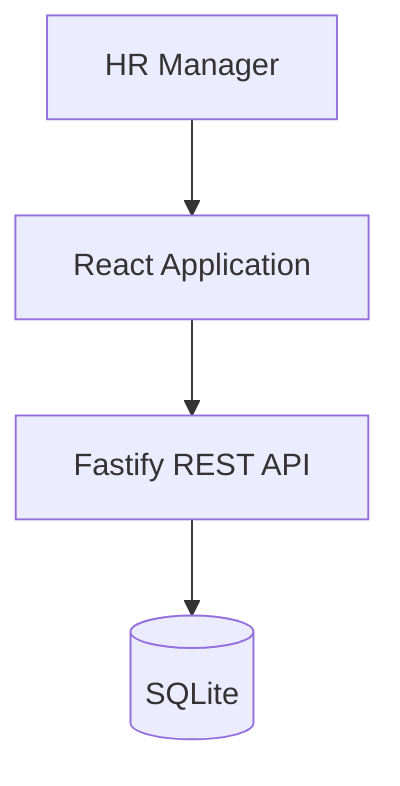

# ACME Salary Management

## Engineering Assessment Specification

This repository contains an end-to-end salary management application built for the Incubyte Software Craftsperson assessment.

The application is intended for an HR Manager managing salary information for approximately 10,000 employees across multiple countries.

This specification is both:

1. The product and technical specification for the application.
2. The working agreement for AI coding agents contributing to this repository.

---

# 1. Important Instructions for AI Coding Agents

If you are an AI coding agent such as Codex, Cursor, Claude Code, Copilot, or another agentic development tool, follow these rules strictly.

## 1.1 Do Not Build the Entire Application at Once

Work incrementally.

Complete only the requested task or phase.

Do not automatically move to the next phase unless explicitly asked.

Do not perform large speculative refactors.

Do not introduce functionality that has not been requested or defined in this specification.

---

## 1.2 Use Test-Driven Development for Business Behaviour

For core domain behaviour:

1. Write or update the specification/test.
2. Confirm the test fails for the expected reason.
3. Implement the smallest reasonable solution.
4. Run tests.
5. Refactor if necessary.
6. Run tests again.
7. Stop and summarize the changes.

Follow:

RED → GREEN → REFACTOR

Not every UI styling change requires TDD, but business rules, API behaviour, validation, analytics calculations, salary changes, filtering, and important workflows should be test-driven.

---

## 1.3 Never Commit Automatically

The AI agent must NOT run:

```bash
git commit
git push
```

unless explicitly instructed.

At the end of each task:

- list changed files
- summarize implementation
- list tests added
- report test results
- identify any assumptions
- suggest a concise commit message

The developer will review the changes and create the commit.

---

## 1.4 Keep Changes Small

Prefer changes that can reasonably become one meaningful Git commit.

Good:

```text
test: define salary validation behaviour
feat: implement salary value validation
feat: add employee pagination API
feat: add deterministic employee seed
```

Bad:

```text
feat: build whole application
```

---

## 1.5 Avoid Overengineering

This assessment evaluates engineering judgment.

Do NOT introduce technologies simply to make the architecture appear sophisticated.

Do not add unless a demonstrated requirement exists:

- microservices
- event sourcing
- CQRS
- Kafka
- Redis
- message queues
- Kubernetes
- GraphQL
- complex repository frameworks
- elaborate dependency injection containers
- premature generic abstractions

Prefer the simplest architecture that cleanly solves the current requirements.

---

## 1.6 AI-Generated Code Must Be Reviewed

Generated code should:

- be understandable without the AI
- follow existing project conventions
- have meaningful names
- avoid unnecessary abstractions
- avoid duplicated business rules
- be covered by appropriate tests
- be type-safe
- handle expected failures
- avoid hidden side effects

When several implementations are possible, explain meaningful trade-offs rather than silently selecting the most complex option.

---

# 2. Product Context

## Organization

ACME operates internationally and employs approximately:

**10,000 employees**

Salary information is currently maintained in spreadsheets.

This creates problems around:

- discovering salary information
- managing salary changes
- analyzing organizational compensation
- maintaining reliable structured data
- scaling HR workflows

---

# 3. Primary User

## HR Manager

The primary user is an HR Manager.

The HR Manager should be able to:

- find an employee quickly
- inspect employee compensation
- update salary information
- explore compensation across the organization
- answer questions about how ACME pays employees

This is NOT intended to become a complete HRMS or payroll system.

---

# 4. Product Goal

Build a web-based employee salary management application that replaces the core spreadsheet-based workflow.

The application should allow an HR Manager to efficiently manage compensation data for 10,000 employees and understand compensation patterns across the organization.

---

# 5. Core Functional Requirements

## 5.1 Employee Directory

The HR Manager can view employees in a structured table.

Display useful fields such as:

- Employee ID
- Name
- Email
- Department
- Job title
- Country
- Current salary
- Currency

The directory must support:

- pagination
- search
- filtering
- sorting

Search should support at minimum:

- employee name
- employee ID

Filters should support at minimum:

- country
- department

Sorting should support relevant fields such as:

- employee name
- salary

Pagination, filtering, search, and sorting should happen server-side.

Do not download all 10,000 employees to the browser for normal table usage.

---

# 6. Employee Details

The HR Manager should be able to open an employee record.

Display:

- basic employee information
- department
- job title
- country
- current salary
- currency
- salary effective date

Salary history should be displayed if salary history is implemented.

---

# 7. Salary Management

The HR Manager can update an employee's salary.

Salary updates must:

- validate the input
- prevent invalid salary values
- preserve monetary precision
- return meaningful API errors
- update the UI after a successful mutation

Salary must NOT be stored using floating-point arithmetic.

Recommended representation:

```text
amountMinor: integer
currency: ISO-4217 currency code
```

Example:

```text
USD 125,000.00
```

may internally be represented as:

```text
amountMinor = 12500000
currency = "USD"
```

---

# 8. Salary History

Preferred design:

Do not destructively replace an employee salary.

Create salary records with an effective date.

Example:

```text
Employee
    │
    └── SalaryRecord[]
```

SalaryRecord should contain:

- id
- employeeId
- amountMinor
- currency
- effectiveFrom
- createdAt

Current salary is the latest applicable salary record.

This provides basic compensation history and improves auditability.

Keep this implementation simple.

---

# 9. Compensation Analytics

The product should help HR answer:

> How does ACME pay its employees?

The dashboard should provide useful compensation information.

At minimum:

### Organizational KPIs

- headcount
- average salary
- median salary
- minimum salary
- maximum salary

Additional metrics can be included where useful.

---

## 9.1 Department Analysis

Provide compensation statistics grouped by department.

Examples:

- headcount
- average salary
- median salary

---

## 9.2 Country Analysis

Provide compensation statistics grouped by country.

Examples:

- headcount
- average salary
- median salary

---

# 10. Multi-Currency Correctness

ACME operates across several countries.

Never directly add salary values expressed in different currencies.

For example:

```text
USD 100,000
+
INR 5,000,000
+
AED 300,000
```

does NOT produce a meaningful global payroll number without currency conversion.

Until a currency-conversion requirement is explicitly introduced:

Prefer analytics grouped by currency or country where necessary.

Do not pretend currencies are directly comparable.

If a reporting/base currency is introduced later, document:

- conversion currency
- FX rates
- source of rates
- effective date
- rounding strategy

Do not introduce live FX integration without a requirement.

---

# 11. Seed Data

The system must support approximately:

**10,000 employees**

Create a seed script producing exactly 10,000 employees.

Seed data should be deterministic.

For Faker:

```typescript
faker.seed(42);
```

Running the seed should produce repeatable data.

Seed employees across realistic:

- countries
- departments
- job titles
- currencies
- salary bands

Avoid completely random salary ranges.

Prefer believable salary bands based on job families or seniority.

Example departments:

- Engineering
- Product
- Finance
- Human Resources
- Sales
- Marketing
- Operations
- Customer Success

The precise data does not need to model real-world compensation perfectly.

The goal is to produce realistic enough data that the analytics are meaningful.

---

# 12. Deliberately Out of Scope

The following functionality is deliberately excluded from the first version.

## Authentication

The assessment assumes a trusted HR Manager user.

Production salary software requires authentication and authorization, but implementing a complete identity system would distract from the core assessment goals.

Architecture should not make future authentication difficult.

---

## Advanced RBAC

Do not implement:

- Admin
- Employee
- Manager
- Finance
- HR permissions

Assume one HR Manager persona.

---

## Payroll Processing

Do not implement:

- salary disbursement
- bank integration
- payslips
- payroll cycles
- taxes
- deductions
- benefits calculations

The application manages and analyzes compensation information.

It is not a payroll engine.

---

## Other HR Functionality

Do not implement:

- recruitment
- onboarding
- leave management
- attendance
- performance reviews
- employee documents
- notifications

---

## Spreadsheet Import

The existing business problem mentions spreadsheets.

Bulk Excel import could be valuable in a real migration, but it is intentionally excluded from the initial assessment scope unless time permits after all primary requirements are complete.

---

## Live FX Conversion

Do not integrate external foreign exchange APIs unless explicitly requested.

---

# 13. Technical Architecture

Use a modular monolith.

Expected architecture:

```text
Browser
   │
   ▼
React Application
   │
   │ REST/JSON
   ▼
Node.js API
   │
   ▼
Relational Database
```

This architecture is intentionally simple.

10,000 employees do not justify distributed system complexity.

---

# 14. Technology Stack

## Language

TypeScript should be used end-to-end wherever practical.

---

## Frontend

Use:

- React
- Vite
- TypeScript
- Material UI
- TanStack Query
- React Hook Form
- Zod

For complex tables use either:

- MUI DataGrid

or:

- TanStack Table

Choose one and document the decision.

---

## Backend

Preferred:

- Node.js
- TypeScript
- Fastify

Reasons for Fastify include:

- small framework surface
- good TypeScript support
- schema-friendly API design
- fast integration testing using `app.inject()`

Express is acceptable if there is a compelling reason, but do not switch frameworks without documenting the decision.

---

## Database

Use:

- SQLite
- Prisma

SQLite is appropriate for the assessment workload and reduces deployment and development complexity.

The data-access design should allow reasonable migration to PostgreSQL if production concurrency or scale requirements change.

---

## Testing

Use:

- Vitest
- React Testing Library
- Fastify integration/API tests
- Playwright for a small number of critical E2E scenarios

Do not chase 100% code coverage.

Prefer meaningful behavioural coverage.

---

# 15. Proposed Repository Structure

Use a workspace structure similar to:

```text
salary-management/
│
├── apps/
│   ├── api/
│   │   ├── src/
│   │   │   ├── modules/
│   │   │   │   ├── employees/
│   │   │   │   ├── salaries/
│   │   │   │   └── analytics/
│   │   │   │
│   │   │   ├── db/
│   │   │   ├── common/
│   │   │   └── app.ts
│   │   │
│   │   └── package.json
│   │
│   └── web/
│       ├── src/
│       │   ├── features/
│       │   │   ├── employees/
│       │   │   ├── salaries/
│       │   │   └── analytics/
│       │   │
│       │   ├── components/
│       │   ├── api/
│       │   ├── pages/
│       │   └── app/
│       │
│       └── package.json
│
├── packages/
│   └── contracts/
│
├── prisma/
│   ├── schema.prisma
│   └── seed.ts
│
├── docs/
│   ├── requirements.md
│   ├── architecture.md
│   ├── tradeoffs.md
│   ├── ai-development-log.md
│   └── performance.md
│
├── .github/
│   └── workflows/
│       └── ci.yml
│
├── SPEC.md
├── README.md
└── package.json
```

Do not create empty abstractions solely to match this structure.

Directories should exist when they have a reason to exist.

---

# 16. API Contract

Use REST.

Base:

```text
/api
```

---

## 16.1 List Employees

```http
GET /api/employees
```

Example query:

```text
?page=1
&pageSize=25
&search=john
&country=AE
&department=Engineering
&sortBy=salary
&sortOrder=desc
```

Example response:

```json
{
  "data": [],
  "pagination": {
    "page": 1,
    "pageSize": 25,
    "total": 10000,
    "totalPages": 400
  }
}
```

---

## 16.2 Employee Details

```http
GET /api/employees/:employeeId
```

Return:

- employee information
- current salary
- salary history where applicable

---

## 16.3 Change Salary

```http
POST /api/employees/:employeeId/salaries
```

Preferred over modifying an existing salary record.

Example request:

```json
{
  "amountMinor": 12500000,
  "currency": "USD",
  "effectiveFrom": "2026-10-01"
}
```

Validation must reject:

- zero salary
- negative salary
- invalid currency
- invalid dates
- malformed requests
- nonexistent employee

---

# 17. Analytics API

Prefer a small API surface.

Example:

```http
GET /api/analytics/summary
```

Optional query parameters:

```text
country
department
```

Response may include:

```json
{
  "headcount": 10000,
  "byCurrency": [
    {
      "currency": "USD",
      "averageSalaryMinor": 9500000,
      "medianSalaryMinor": 8700000,
      "minSalaryMinor": 4000000,
      "maxSalaryMinor": 22000000
    }
  ]
}
```

Additional endpoints may include:

```http
GET /api/analytics/departments
GET /api/analytics/countries
```

Do not fragment the API unnecessarily.

---

# 18. API Error Contract

Use predictable error responses.

Example:

```json
{
  "error": {
    "code": "INVALID_SALARY",
    "message": "Salary must be greater than zero."
  }
}
```

Do not expose stack traces to API consumers.

Expected categories include:

```text
VALIDATION_ERROR
EMPLOYEE_NOT_FOUND
INVALID_SALARY
INTERNAL_ERROR
```

HTTP status codes should accurately represent failures.

---

# 19. Shared Contracts

Where useful, share contracts between frontend and backend.

The `packages/contracts` package may contain:

- Zod schemas
- TypeScript request types
- TypeScript response types
- enums/value definitions

Do not put business logic in the contracts package.

---

# 20. Backend Design Principles

Prefer feature/module organization.

Example:

```text
employees/
    employee.routes.ts
    employee.service.ts
    employee.repository.ts
    employee.schema.ts
    employee.test.ts
```

Do not create layers merely for ceremony.

A repository abstraction is justified when it improves testing or separates database access from business behaviour.

Business logic should not live directly in HTTP route handlers.

---

# 21. Frontend Design Principles

Organize primarily by product feature.

Example:

```text
features/
    employees/
        api/
        components/
        hooks/
        types/
```

Avoid a giant generic `utils` directory.

Avoid putting the entire application into a single component.

Prefer components with one clear responsibility.

---

# 22. Employee Directory UX

The directory should include:

- loading state
- empty state
- error state
- pagination
- search
- country filter
- department filter
- sorting

Search input should be debounced where appropriate.

Target:

```text
~300ms debounce
```

Changing filters should reset pagination when necessary.

The URL may preserve table filters if this can be implemented without unnecessary complexity.

---

# 23. Salary Update UX

Provide a clear salary-edit workflow.

Possibilities include:

- modal
- drawer
- employee details form

The interface must:

- show current salary
- request new salary
- specify currency
- specify effective date where relevant
- show validation errors
- prevent accidental duplicate submissions
- show successful completion
- refresh affected employee and analytics queries

---

# 24. Dashboard UX

Keep the dashboard intentionally focused.

Suggested structure:

```text
----------------------------------------------------
 Headcount | Avg Salary | Median Salary | Range
----------------------------------------------------

 Filters:
 [Country] [Department]

----------------------------------------------------
 Average Salary by Department
----------------------------------------------------

----------------------------------------------------
 Salary / Headcount by Country
----------------------------------------------------
```

Prefer useful information over decorative charts.

Charts should not imply cross-currency comparisons that are mathematically invalid.

---

# 25. Database Model

Initial conceptual model:

```text
Employee

id
employeeCode
firstName
lastName
email
countryCode
department
jobTitle
createdAt
updatedAt
```

Relationship:

```text
Employee 1 ─────────────── * SalaryRecord
```

SalaryRecord:

```text
id
employeeId
amountMinor
currency
effectiveFrom
createdAt
```

Exact Prisma schema should be created through TDD/design work rather than blindly copied from this document.

---

# 26. Database Indexing

Indexes should support common queries.

Candidates include:

```text
employeeCode
email
countryCode
department
```

Potential composite/index strategy should be based on actual query patterns.

Do not add indexes without understanding the queries they serve.

---

# 27. Performance Requirements

10,000 employees is moderate scale.

Do not optimize prematurely, but make obvious scalable choices.

Required considerations:

### Server-side pagination

Do not routinely return all employees.

Typical page size:

```text
25–50
```

Maximum page size should be bounded.

---

### Search

Search should execute server-side.

Avoid firing a request on every keystroke without throttling/debouncing.

---

### Database

Use pagination and filtering at the query/database level.

Avoid:

```text
fetch all rows → filter in Node.js
```

for normal directory operations.

---

### Analytics

Prefer database aggregation where reasonable.

Avoid downloading all salaries to React to calculate analytics.

---

### Frontend

Avoid unnecessary rerenders.

Do not prematurely add memoization everywhere.

Use profiling/evidence when optimizing non-obvious problems.

---

# 28. Security Considerations

Even though authentication is deliberately excluded:

- validate all API inputs
- do not trust frontend validation
- do not expose stack traces
- avoid logging salary values unnecessarily
- use ORM parameterization
- validate pagination boundaries
- constrain sorting fields
- validate IDs
- validate currency codes
- protect against malformed input

Document that real production salary software requires robust authentication, authorization, encryption, audit logging, and privacy controls.

---

# 29. Testing Strategy

Testing should focus on behaviour.

## Domain / Service Tests

Examples:

```text
salary cannot be negative
salary cannot be zero
unsupported currency is rejected
salary history is preserved
```

---

## Employee API Tests

Examples:

```text
returns paginated employees

searches employees by name

searches employees by employee ID

filters employees by country

filters employees by department

sorts employees

rejects invalid pagination

returns 404 for nonexistent employee
```

---

## Salary API Tests

Examples:

```text
creates salary record

rejects negative salary

rejects invalid currency

rejects invalid effective date

returns employee not found

preserves previous salary record
```

---

## Analytics Tests

Use deterministic fixture data.

Examples:

```text
calculates employee count

calculates average salary correctly

calculates median correctly

calculates min/max correctly

filters analytics by department

filters analytics by country

does not combine different currencies incorrectly
```

Analytics calculations deserve particularly strong testing.

---

## Frontend Tests

Focus on user-visible behaviour.

Examples:

```text
employee table renders API data

loading state appears

empty state appears

API errors display correctly

changing department updates the query

invalid salary displays validation

valid salary can be submitted
```

Avoid testing React implementation details.

---

## E2E Tests

Keep E2E coverage focused.

Suggested scenarios:

### Scenario 1

HR searches for an employee.

### Scenario 2

HR opens an employee and changes their salary.

### Scenario 3

HR filters compensation analytics.

Three strong E2E scenarios are preferable to a large fragile suite.

---

# 30. Deterministic Tests

Tests must:

- not depend on test execution order
- not depend on external APIs
- not depend on random values unless seeded
- clean up database state appropriately
- produce repeatable results

---

# 31. CI Requirements

GitHub Actions should eventually run:

```text
install
lint
typecheck
test
build
```

E2E may be added once the deployment/application flow stabilizes.

A pull request or push should not pass CI when:

- TypeScript fails
- lint fails
- unit tests fail
- build fails

---

# 32. Documentation Artifacts

Maintain:

```text
docs/requirements.md
docs/architecture.md
docs/tradeoffs.md
docs/ai-development-log.md
docs/performance.md
```

Keep documentation concise and useful.

Do not write documentation purely to increase volume.

---

# 33. AI Development Log

Maintain:

```text
docs/ai-development-log.md
```

The purpose is to explain how AI contributed to the solution.

Suggested structure:

```markdown
# AI Development Log

## Task

What I was trying to accomplish.

## AI Prompt / Request

Summary or exact prompt where useful.

## AI Contribution

What the tool proposed or generated.

## Engineering Review

What I accepted.

What I changed.

What I rejected.

Why.

## Verification

Tests, type checking, manual testing, or other verification performed.
```

Do not create an entry for every autocomplete.

Document meaningful AI-assisted engineering decisions.

---

# 34. Architecture Documentation

`docs/architecture.md` should eventually explain:

- application structure
- frontend/backend separation
- database choice
- salary model
- request flow
- deployment architecture

Include a lightweight diagram.

Mermaid is acceptable.

Example:



---

# 35. Trade-Off Documentation

`docs/tradeoffs.md` should document meaningful decisions such as:

### React SPA vs Next.js

Why React + Vite fits an internal HR application.

### SQLite vs PostgreSQL

Why SQLite is sufficient for this assessment and what would trigger migration.

### Modular monolith vs microservices

Why distributed architecture is unnecessary.

### Salary history vs destructive salary updates

Why preserving salary history improves auditability.

### Server-side pagination

Why it was chosen even though 10,000 records could technically fit in browser memory.

### Currency handling

Why cross-currency values are not blindly aggregated.

---

# 36. Performance Documentation

`docs/performance.md` should eventually include:

- expected workload
- pagination strategy
- search strategy
- indexes
- aggregation strategy
- frontend rendering considerations

If simple measurements are collected, document:

```text
seed size
endpoint
query parameters
approximate response time
environment
```

Do not manufacture benchmark results.

---

# 37. README Expectations

Final README should include:

```text
Project overview

Live application URL

Demo video URL

Architecture summary

Technology stack

Local setup

Database migration

Database seeding

Development commands

Testing commands

Build commands

Important engineering decisions

Assessment artifacts

Known limitations

Future improvements
```

Reviewer setup should be easy.

Aim for something close to:

```bash
pnpm install
pnpm db:setup
pnpm dev
```

---

# 38. Deployment

The finished assessment must be deployed.

Deployment decisions can be made later.

Priorities:

1. reviewer can access application easily
2. setup is reproducible
3. deployment does not require unnecessarily complex infrastructure

SQLite deployment constraints must be considered when choosing hosting.

If hosting makes durable SQLite unsuitable, migrating deployment persistence to PostgreSQL is acceptable if documented.

Do not migrate merely because PostgreSQL appears more "production-like."

---

# 39. Accessibility

Use accessible UI primitives.

At minimum:

- form labels
- keyboard-accessible controls
- appropriate buttons
- table semantics where applicable
- visible validation messages
- reasonable color contrast
- focus management for dialogs where needed

Material UI should provide a good baseline, but accessibility remains the application's responsibility.

---

# 40. Definition of Done

A feature is done when relevant items below are satisfied:

- requirement is understood
- behaviour is tested where appropriate
- implementation is complete
- tests pass
- TypeScript passes
- lint passes
- no known console/server errors
- error states are handled
- relevant documentation is updated
- AI usage is documented when meaningful
- change is small enough to review
- suggested commit message accurately describes the change

---

# 41. Development Phases

The application should be implemented incrementally.

Do not skip directly to later phases.

---

## Phase 0 — Product Specification

Create:

```text
docs/requirements.md
docs/architecture.md
docs/tradeoffs.md
docs/ai-development-log.md
```

Do not build application features yet.

### Suggested commit

```text
docs: define product scope and engineering approach
```

---

## Phase 1 — Workspace Bootstrap

Initialize:

- pnpm workspace
- TypeScript
- apps/api
- apps/web
- packages/contracts
- ESLint
- Prettier
- Vitest

Confirm:

```text
pnpm install
pnpm lint
pnpm typecheck
pnpm test
```

works.

Avoid feature implementation.

### Suggested commit

```text
chore: initialise TypeScript workspace
```

---

## Phase 2 — First Domain Behaviour

Start with salary validation using TDD.

Write tests first.

Examples:

```text
accept positive monetary amount
reject zero salary
reject negative salary
reject unsupported currency
```

Then implement minimum code.

### Suggested commits

```text
test: define salary validation behaviour
```

then:

```text
feat: implement salary validation
```

or combine RED/GREEN into one small feature commit if repository history remains clear.

---

## Phase 3 — Database Foundation

Introduce Prisma and SQLite.

Implement minimum schema for:

- Employee
- SalaryRecord

Add migration.

Do not seed 10,000 employees yet.

### Suggested commit

```text
feat: add employee and salary persistence model
```

---

## Phase 4 — Employee Listing API

TDD:

```text
paginated employees
pagination metadata
invalid pagination behaviour
```

Then implementation.

### Suggested commits

```text
test: define employee pagination behaviour
feat: implement paginated employee API
```

---

## Phase 5 — Search / Filtering / Sorting

Implement incrementally.

Possible commits:

```text
test: define employee search behaviour
feat: add employee search
```

```text
test: define employee filtering behaviour
feat: add employee filters
```

```text
test: define employee sorting behaviour
feat: add employee sorting
```

---

## Phase 6 — Deterministic Seed

Create exactly:

```text
10,000 employees
```

Make data deterministic.

Verify seed count.

### Suggested commit

```text
feat: add deterministic 10k employee seed
```

---

## Phase 7 — Employee Directory UI

Build basic application shell.

Then employee table.

Then search/filter/pagination.

Keep UI functionality incremental.

Suggested commits:

```text
feat: add application shell and navigation
```

```text
feat: build paginated employee directory
```

```text
feat: add employee search and filters
```

---

## Phase 8 — Employee Details

Add:

```text
GET /api/employees/:id
```

then employee UI.

Suggested commits:

```text
feat: expose employee compensation details
```

```text
feat: build employee details view
```

---

## Phase 9 — Salary Changes

TDD salary change behaviour first.

Include salary history.

Suggested commits:

```text
test: define employee salary change behaviour
```

```text
feat: implement salary history workflow
```

```text
feat: add salary update interface
```

---

## Phase 10 — Analytics Domain

Start with deterministic tests.

Implement:

- headcount
- average
- median
- min/max
- grouping
- filters
- currency correctness

Suggested commits:

```text
test: define compensation analytics behaviour
```

```text
feat: implement compensation analytics
```

---

## Phase 11 — Dashboard

Create:

- KPI cards
- filters
- department analysis
- country analysis

Suggested commit:

```text
feat: build compensation insights dashboard
```

---

## Phase 12 — Critical UI Testing

Add meaningful React tests.

Suggested commit:

```text
test: cover critical frontend workflows
```

---

## Phase 13 — E2E

Add Playwright scenarios.

Suggested commit:

```text
test: add end-to-end salary management flows
```

---

## Phase 14 — CI

Add GitHub Actions.

Suggested commit:

```text
ci: add automated quality checks
```

---

## Phase 15 — Performance Review

Review actual queries.

Check:

- indexes
- response sizes
- query patterns
- frontend rendering

Document observed behaviour.

Only optimize problems supported by evidence.

Suggested commit:

```text
perf: optimize employee query paths
```

if optimization is genuinely needed.

Otherwise:

```text
docs: document performance considerations
```

---

## Phase 16 — Deployment

Deploy application.

Verify production environment.

Suggested commit:

```text
chore: configure production deployment
```

---

## Phase 17 — Assessment Documentation

Finish:

```text
README.md
docs/architecture.md
docs/tradeoffs.md
docs/ai-development-log.md
docs/performance.md
```

Review repository history.

Suggested commit:

```text
docs: complete assessment documentation
```

---

# 42. Agent Completion Format

Whenever an AI agent completes a requested development task, respond using:

```text
Completed:
- ...

Files changed:
- ...

Tests added/updated:
- ...

Verification:
- pnpm ...
- Result: ...

Engineering decisions:
- ...

Assumptions:
- ...

Not implemented:
- ...

Suggested commit:
<type>: <message>

Recommended next step:
...
```

Do NOT continue to the recommended next step automatically.

---

# 43. Quality Gate Before Every Commit

Before suggesting a commit, run relevant commands.

Eventually the default quality gate should be:

```bash
pnpm lint
pnpm typecheck
pnpm test
```

When relevant:

```bash
pnpm build
```

Do not suggest committing known failing code unless intentionally demonstrating the RED stage of TDD and the developer explicitly wants the failing test preserved as a commit.

---

# 44. Engineering Philosophy

Optimize the assessment for:

```text
clarity
correctness
maintainability
testability
product value
engineering judgment
```

Do not optimize for:

```text
maximum number of technologies
maximum number of features
maximum abstraction
clever code
architecture complexity
```

The final solution should feel like something another engineer could comfortably understand, review, run, test, and continue developing.

---

# 45. Current Development State

The repository is currently empty.

The developer has created the Git repository and opened it in VS Code.

The next activity is:

**Phase 0 — Product Specification**

Do not initialize application frameworks until Phase 0 has been reviewed and committed.