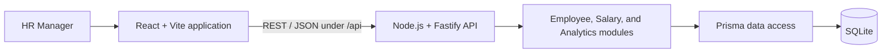

# Proposed Architecture

> Status: Phase 3 persistence foundation implemented. The employee and salary-history schema, migration, client boundary, and minimal repository exist; product APIs and UI features have not started.

## Overview

The proposed system is a TypeScript modular monolith: a React single-page application communicates over REST/JSON with a Node.js Fastify API backed by SQLite through Prisma. This keeps deployment and local development simple for an assessment-scale workload while retaining clear feature boundaries.

The browser will request only the employee page or analytics result it needs. Filtering, sorting, pagination, and aggregation belong on the server and database path rather than in the browser.

## Proposed application structure

- `apps/web`: React, Vite, TypeScript, Material UI, TanStack Query, React Hook Form, and Zod. UI code will be organized primarily by employee, salary, and analytics features.
- `apps/api`: Fastify and TypeScript, with the salary domain kept separate from a small Prisma client boundary and employee repository. Future route handlers will translate HTTP concerns; business rules will remain outside handlers.
- `packages/contracts`: shared Zod schemas and TypeScript request/response contracts where sharing reduces drift. It will not contain business logic.
- `apps/api/prisma`: the SQLite schema and versioned migrations. Generated Prisma Client code is reproducible through `pnpm db:generate` and excluded from version control. Deterministic bulk seeding remains a later phase.

MUI DataGrid is the initial table choice because pagination, sorting, accessibility primitives, and Material UI integration match the directory needs. This remains a proposal until the employee-directory phase validates licensing and feature requirements.

## Domain and data model

The implemented persistence model has an `Employee` with many append-style `SalaryRecord` entries. Employee codes and emails are unique; country, department, and job title remain required string attributes. A salary record contains an integer `amountMinor`, `currency`, `effectiveFrom`, and creation metadata. Required foreign keys and cascading employee deletion prevent orphan salary rows.

Future-dated salary records are intentionally allowed. Current salary will eventually be derived from the applicable record with the latest `effectiveFrom`; selection rules for future dates and ties still require domain/service tests before that behavior is implemented.

Salary amount and supported-currency validation remain in the plain TypeScript domain. SQLite complements those rules with integer storage, required fields, uniqueness, and referential integrity; it does not duplicate the supported-currency list.

Analytics will group salary values by currency whenever aggregation could cross currencies. No base-currency conversion or external FX dependency is proposed.

## Request flow

1. React derives query parameters from the directory or dashboard state.
2. Fastify validates path, query, and body data against explicit schemas.
3. A feature service applies business rules and asks its data-access code for bounded queries or database aggregations.
4. Prisma executes parameterized SQLite queries.
5. The API returns typed success data or a predictable error envelope without stack traces.
6. TanStack Query caches server state and invalidates affected employee and analytics queries after mutations.

The likely initial API surface is `GET /api/employees`, `GET /api/employees/:employeeId`, `POST /api/employees/:employeeId/salaries`, and a small set of `/api/analytics` endpoints. Contracts will be refined incrementally rather than treated as implemented by this document.

## Quality and operational boundaries

- Business behaviour will follow red-green-refactor TDD, with Fastify integration tests, focused React tests, and a few critical Playwright flows.
- Employee queries will use bounded server-side pagination and allow-listed sort fields. Indexes will be selected from observed query patterns, not added speculatively.
- Persistence tests recreate an ignored `prisma/test.db` from committed migrations for each suite and clear tables between cases, so they never use developer data or depend on execution order.
- The API will validate independently of the UI, avoid sensitive-value logging, and expose consistent error codes.
- The modular boundaries leave a natural place to add authentication later, but production-grade identity, audit, encryption, and privacy controls are explicitly not implemented yet.

## Deployment direction

Development and assessment review initially target a single web application, API process, and SQLite database. Deployment has not been chosen. If the eventual host cannot provide durable SQLite storage, or real concurrency and operational requirements outgrow it, the Prisma-backed persistence layer can be migrated deliberately to PostgreSQL. That is a future decision based on evidence, not part of Phase 0.
