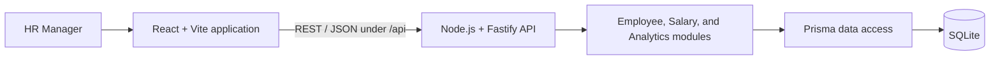

# Implemented Architecture

> Status: Phase 17 local submission review complete. The modular monolith can run as one compiled Render web service with a persistent SQLite disk; the public service has not yet been provisioned.

## Overview

The system is a TypeScript modular monolith: a React single-page application communicates over REST/JSON with a Node.js Fastify API backed by SQLite through Prisma. This keeps deployment and local development simple for an assessment-scale workload while retaining clear feature boundaries.

The browser will request only the employee page or analytics result it needs. Filtering, sorting, pagination, and aggregation belong on the server and database path rather than in the browser.

## Application structure

- `apps/web`: React, Vite, TypeScript, React Router, Material UI, MUI DataGrid, TanStack Query, React Hook Form, and Zod. Employee features own list/detail retrieval, the salary feature owns mutation and exact major/minor conversion, and the analytics feature owns dashboard requests and presentation without recalculating server metrics.
- `apps/api`: Fastify and TypeScript, with employee, salary, and analytics modules separated by feature. Analytics routes validate filters, the service computes population/group metrics, and the repository retrieves only employee dimensions plus one currently effective salary per employee.
- `apps/api/src/seed`: pure deterministic employee/salary generation, batched database insertion, and the executable seed entry point. Runtime API modules do not depend on seed code.
- `packages/contracts`: shared Zod schemas and TypeScript request/response contracts for employee, salary, and analytics transport data. Shared supported-currency and country/currency values keep both application sides aligned without moving business calculations into this package.
- `apps/api/prisma`: the SQLite schema and versioned migrations. Generated Prisma Client code is reproducible through `pnpm db:generate` and excluded from version control. Deterministic bulk seeding is available through `pnpm db:seed`.

MUI DataGrid Community is the implemented directory table because its server modes, pagination controls, accessible grid semantics, and Material UI integration cover the current requirements without paid features.

## Domain and data model

The implemented persistence model has an `Employee` with many append-style `SalaryRecord` entries. Employee codes and emails are unique; country, department, and job title remain required string attributes. A salary record contains an integer `amountMinor`, `currency`, `effectiveFrom`, and creation metadata. Required foreign keys and cascading employee deletion prevent orphan salary rows.

Future-dated and unambiguous backdated salary records are intentionally allowed. Salary changes insert new rows and never overwrite history. The employee listing derives current salary as the record with the latest `effectiveFrom` at or before one request-scoped `asOf` time. A future-only or absent salary produces `currentSalary: null`. A database uniqueness constraint on `(employeeId, effectiveFrom)` prevents ambiguous same-date records, including concurrent duplicate submissions.

Salary amount and supported-currency validation remain in the plain TypeScript domain. SQLite complements those rules with integer storage, required fields, uniqueness, and referential integrity; it does not duplicate the supported-currency list.

Analytics group salary values by currency whenever aggregation could cross currencies. Headcount includes employees without a current salary, while monetary statistics exclude them rather than treating missing compensation as zero. No base-currency conversion or external FX dependency exists.

## Deterministic synthetic data

`pnpm db:seed` recreates all employee and salary data from seed `42`, producing deterministic IDs, `EMP000001`–`EMP010000` codes, fictional `acme.example` emails, and fixed persistence/effective-date ranges. The generator targets this country distribution: US 25%, IN 25%, AE 12%, GB 10%, DE 8%, SG 7%, AU 7%, and CA 6%. Its department targets are Engineering 30%, Sales 18%, Operations 14%, Customer Success 12%, Product 9%, Finance 7%, Marketing 6%, and Human Resources 4%.

Job titles come from department-specific weighted families. Synthetic annual salaries use country- and seniority-level bands plus a small department multiplier, are rounded to whole hundreds of major units, converted to integer minor units, and validated by the salary domain. The data is illustrative rather than a statement of market compensation. About 24% of employees receive two records and 8% receive three; all effective dates are fixed within or before 2026, and later records never reduce salary.

## Request flow

1. React keeps directory controls in local component state, debounces search by 300 ms, converts DataGrid's zero-based page to the API's one-based page, and resets pagination when search, filters, page size, or sorting changes.
2. Fastify validates path, query, and body data against explicit schemas. The employee list accepts bounded pagination plus `search`, `country`, `department`, `sortBy`, and `sortOrder`; arbitrary parameters and sort fields are rejected.
3. A feature service applies business rules and asks its data-access code for bounded queries or database aggregations.
4. Prisma applies the same database `where` conditions to the filtered count and page queries, then orders before applying offset pagination. Search trims input and ANDs whitespace-delimited terms; each term may match first name, last name, or employee code through SQLite's case-insensitive ASCII `LIKE` behavior. Country codes are uppercased and matched exactly, while trimmed departments retain exact casing.
5. The page query includes at most one currently effective salary per employee, avoiding per-employee salary queries and unnecessary history in the response.
6. `GET /api/employees/:employeeId` retrieves one employee and its ordered salary records in one relation query. The service maps persistence dates to transport strings and selects the first record effective at or before the request's controlled `asOf` time.
7. The API returns typed success data or a predictable error envelope without stack traces. Unknown opaque employee IDs return `EMPLOYEE_NOT_FOUND` with HTTP 404.
8. TanStack Query keys cached employee pages by the complete list query and detail records by `['employee', employeeId]`. The Vite development server proxies `/api` to the local API; `VITE_API_BASE_URL` can select the deployed same-origin API path or gateway.
9. `POST /api/employees/:employeeId/salaries` validates the transport shape, delegates amount/currency rules to the salary domain, enforces the employee's established currency (or configured country currency for first salary), checks duplicate dates, and inserts one record. Effective dates are interpreted as the start of the supplied calendar date in UTC.
10. The details-page dialog accepts human-readable major units, converts the decimal string to integer minor units without floating-point multiplication, and disables submission while pending. Success invalidates employee detail, employee-list, and analytics query families so current salary, history, and compensation insights are refreshed.
11. Analytics uses one Prisma employee query with database filters and a bounded relation projection containing at most the latest salary effective at the request-scoped `asOf` time. The service groups those minimal current-salary rows by currency and, where requested, department or country; historical and future records never enter calculations.
12. The dashboard starts three independent TanStack Query requests in parallel. Stable keys include only filters supported by each endpoint: summary uses country and department, department analytics uses country, and country analytics uses department. The React layer formats and visualizes returned data but does not recompute compensation statistics.

The implemented API surface includes `GET /api/employees`, `GET /api/employees/:employeeId`, `POST /api/employees/:employeeId/salaries`, `GET /api/analytics/summary`, `GET /api/analytics/departments`, `GET /api/analytics/countries`, and the bootstrap health route. The browser exposes `/dashboard`, `/employees`, and `/employees/:employeeId`, with `/` redirecting to the dashboard.

## Testing and operational boundaries

- Business behaviour follows red-green-refactor TDD. Vitest covers domain behavior and migrated-database Fastify integration tests; React Testing Library covers visible frontend behavior; three serial Playwright scenarios exercise dashboard filtering, employee search/details, and salary-change persistence end to end.
- Employee listing uses bounded server-side offset pagination. Its allowlist supports employee code, first name, last name, department, and country, defaulting to `employeeCode ASC`; non-unique fields use `employeeCode ASC` as a stable secondary order.
- Salary sorting is deliberately rejected: correct ordering would require a specialized query over each employee's current effective record, and raw minor-unit comparisons across currencies would be misleading.
- Existing unique employee-code and country/department indexes support exact directory queries. No name index was added because the current contains search is not expected to benefit from a normal B-tree index.
- Analytics reuses the country, department, and unique `(employeeId, effectiveFrom)` indexes. Seeded measurements did not justify another index; filtered responses were materially faster than the unfiltered 10,000-employee baseline.
- Persistence tests recreate an ignored `prisma/test.db` from committed migrations for each suite and clear tables between cases, so they never use developer data or depend on execution order.
- The API validates independently of the UI, avoids sensitive-value logging, and exposes consistent errors for invalid salaries, unsupported currencies, missing employees, and effective-date conflicts.
- The modular boundaries leave a natural place to add authentication later, but production-grade identity, audit, encryption, and privacy controls are explicitly not implemented yet.

## Deployment

Production targets one Render Node web service. The compiled Fastify process serves REST endpoints under `/api`, the health check at `/health`, and the compiled React assets with SPA fallback. Same-origin browser requests preserve the existing `/api` client default and avoid a separate CORS policy. Fingerprinted assets receive immutable caching while the SPA entry point remains non-cacheable.

Render mounts a 1 GB persistent disk at `/var/data`, and Prisma uses `file:/var/data/acme.db`. The start command applies committed migrations before accepting traffic. The deterministic but destructive assessment seed is restricted to Render's one-time initial deploy hook; routine deploys and restarts neither reset nor reseed data.

The API validates `DATABASE_URL`, `NODE_ENV`, and `PORT` before listening on `0.0.0.0`, logs through Fastify, exposes no stack traces in its public error envelope, applies baseline security headers, and closes Fastify and Prisma on SIGINT or SIGTERM. Render disk constraints intentionally limit this SQLite topology to one service instance and rule out zero-downtime multi-instance deployment. PostgreSQL remains the migration path if concurrency, availability, backup, or horizontal-scaling requirements grow.
